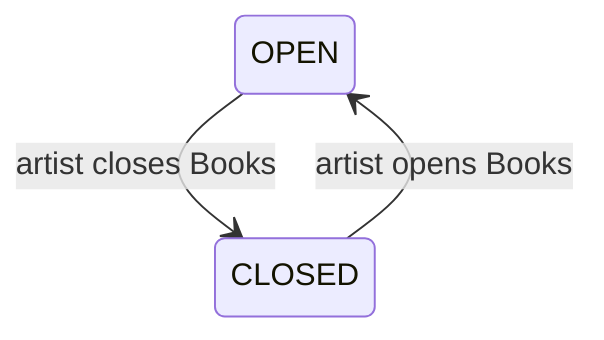
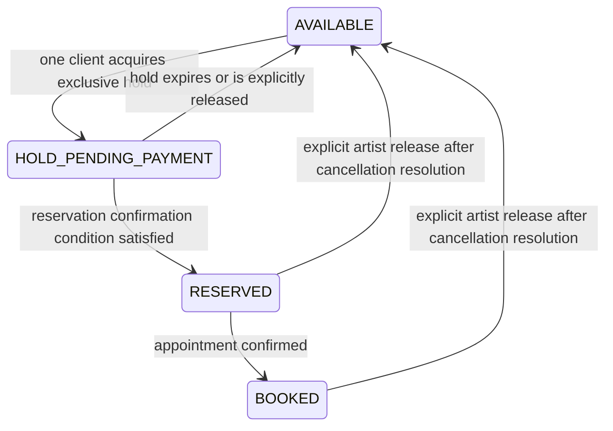
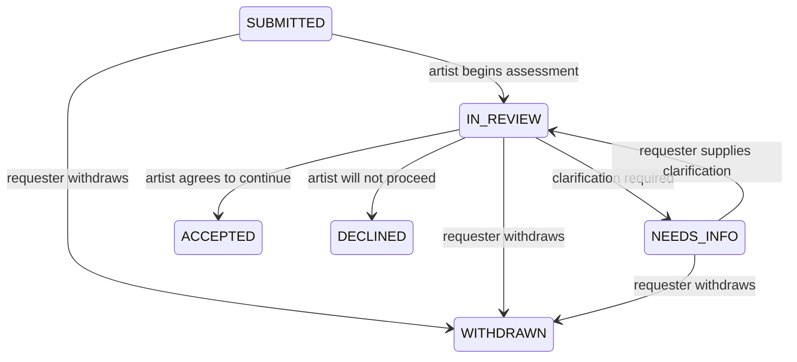

# Tattoo V1 — Books, Flash and Custom Request Semantics

**Status:** Founder-approved M2 definition — Issue #12 complete  
**Issue:** #12  
**Scope:** Tattoo product/domain semantics only. This document does not define payment-provider architecture, database schema, authentication, deployment, final storefront IA, or implementation.

## 1. Evidence boundary

This definition is grounded primarily in TAT-01, TAT-02, the M1 evidence synthesis, the approved Issue #11 customer/outcome definition, and the current Tattoo V1 hypothesis.

### Repeated evidence

Both Tattoo participants independently reported:

- Books Open / Closed communication is currently manual and does not reliably stop enquiries;
- custom requests need structured qualification before the artist can assess them;
- placement, size and references are repeatedly collected;
- Flash is manually marked claimed;
- Flash double-booking has occurred;
- deposits are handled separately from the request/design today.

### Product decisions in this document

The exact state names and transition rules below are **Founder-approved M2 product decisions from Issue #12**. They are not all directly observed in research.

Where payment timing, refund behavior or provider behavior is involved, this document defines only the minimum state boundary needed by #12. Issue #14 remains authoritative for deposit semantics.

---

# 2. Domain separation

Books, Flash and Custom Request are deliberately separate concepts.

They must not be collapsed into a generic `availability`, `booking`, `lead` or workflow abstraction during V1.

## Domain law A — Books controls Custom Request intake

Books answers:

> Is this artist currently accepting new custom tattoo requests?

Books does **not** answer:

- which appointment slots exist;
- whether a particular date is free;
- whether a Flash design is available;
- whether an existing request has been accepted.

## Domain law B — Flash has its own scarce-inventory state

Flash availability belongs to the individual Flash design.

Therefore an artist may be:

- **Books CLOSED**, while one or more published Flash designs remain AVAILABLE; or
- **Books OPEN**, while a particular Flash design is RESERVED or BOOKED.

This separation is intentional.

## Domain law C — Custom Request is qualification, not scheduling

A Custom Request is a structured request for the artist to assess.

It is **not**:

- an appointment;
- a calendar reservation;
- a guaranteed acceptance;
- a guaranteed price;
- a guaranteed tattoo date.

---

# 3. Books

## 3.1 States

Tattoo V1 has two Books states:

### OPEN

Meaning:

> The artist is currently accepting new Custom Requests.

Effects:

- the public storefront clearly shows Books Open;
- the Custom Request entry point is enabled;
- clients may submit new Custom Requests;
- this does **not** imply any particular appointment slot is available;
- this does **not** guarantee the artist will accept a submitted request.

### CLOSED

Meaning:

> The artist is not currently accepting new Custom Requests.

Effects:

- the public storefront clearly shows Books Closed;
- new Custom Request submission is unavailable;
- existing submitted requests remain valid and continue through their lifecycle;
- portfolio and other public artist information remain visible;
- published Flash remains governed by each Flash item's own state.

Books Closed must not silently create an informal waitlist.

A waitlist is not part of Tattoo V1 unless later evidence explicitly adds it.

## 3.2 State transitions

Transitions are artist-controlled.

There is no calendar-driven automatic Books state change in V1.

## 3.3 Future opening information

V1 may show an **optional future opening date or reopening note** while Books are CLOSED.

Examples:

- "Books reopen 4 November"
- "Books reopen in January"

Semantics:

- informational only;
- optional;
- does not create a waitlist;
- does not automatically transition Books to OPEN;
- the artist must explicitly reopen Books.

The exact display treatment belongs to #13/M3.

## 3.4 Guest Spot

A Guest Spot is an optional dated location notice on the same artist storefront.

Example:

> Amsterdam · 12–16 May

A Guest Spot:

- may coexist with Books OPEN or CLOSED;
- does not create a second business/workspace;
- does not create a location engine;
- does not automatically override Books state;
- does not itself promise appointment availability.

If the artist wants to accept Custom Requests for the Guest Spot through the normal V1 request flow, Books must be OPEN. The Guest Spot provides context; Books still governs whether new Custom Requests are accepted.

---

# 4. Flash

## 4.1 V1 meaning

A Flash item is a published scarce tattoo design that can be assigned to only one customer at a time.

V1 treats Flash as scarce inventory, not as a generic gallery image.

The core invariant is:

> **One scarce Flash design must never have two confirmed customers.**

For V1, repeatable/unlimited Flash is not part of the core reservation model. If later research shows a meaningful need for repeatable designs, it should be modeled explicitly rather than weakening the scarce-design invariant.

## 4.2 States

### AVAILABLE

Meaning:

> No customer currently owns an active hold or confirmed reservation for this Flash design.

Effects:

- the design may be shown as available;
- a client may start a Flash claim/reservation attempt;
- only one claim may successfully acquire the exclusive hold.

### HOLD_PENDING_PAYMENT

Meaning:

> One client has a temporary exclusive hold while the reservation-confirmation condition is being completed.

Effects:

- exactly one client owns the hold;
- the design is temporarily unavailable to other clients;
- other clients must not be able to create another active hold or confirmed reservation;
- the hold is **not yet a confirmed reservation**;
- the hold has a finite expiry.

The exact event that starts the hold, the hold duration and payment/deposit condition belong to #14.

### RESERVED

Meaning:

> One customer has a confirmed exclusive reservation for the Flash design.

Effects:

- the Flash design is unavailable to everyone else;
- the customer is the single confirmed owner of the reservation;
- an appointment date does **not** have to exist yet;
- RESERVED therefore does not mean BOOKED.

The exact deposit/payment condition required to reach RESERVED belongs to #14.

### BOOKED

Meaning:

> The reserved customer also has a confirmed tattoo appointment for that Flash design.

Effects:

- the design remains unavailable to everyone else;
- the Flash/customer relationship remains exclusive;
- V1 does not need a separate "tattoo completed" state for the public reservation model.

BOOKED is the normal terminal state for the V1 Flash reservation lifecycle.

## 4.3 State transitions

## 4.4 Flash transition rules

1. **Only AVAILABLE may start a new hold.**

2. **Only one active exclusive customer may exist for a Flash design across HOLD_PENDING_PAYMENT, RESERVED and BOOKED.**

3. **HOLD_PENDING_PAYMENT blocks competing claims.**  
   A hold may be temporary, but it is exclusive while active.

4. **Hold expiry must be deterministic.**  
   If the confirmation condition is not satisfied before expiry, the hold returns to AVAILABLE unless an explicit product rule approved in #14 says otherwise.

5. **RESERVED is confirmed but not necessarily scheduled.**

6. **BOOKED means the appointment has been confirmed.**

7. **Cancellation never silently re-releases scarce Flash.**  
   A RESERVED or BOOKED design returns to AVAILABLE only through an explicit artist release after the relevant cancellation/refund obligation has been resolved.

8. **Money state and Flash state are related but not identical.**  
   Issue #14 defines deposit amounts, payment success, refund/cancellation semantics and the exact confirmation event.

9. **Public captions are not the source of reservation truth.**  
   Flash availability must be represented by explicit product state.

## 4.5 Failure cases that V1 must prevent

The product must make these impossible as valid outcomes:

- two active holds for the same scarce design;
- one customer RESERVED while another customer is also RESERVED or BOOKED;
- one customer BOOKED while the design is shown/treated as AVAILABLE;
- hold expiry creating a second reservation while the first reservation is already confirmed;
- automatic re-release after cancellation before the artist has explicitly released the design.

How these guarantees are implemented belongs to M4.

---

# 5. Custom Request

## 5.1 Meaning

A Custom Request is a structured lead/request submitted to a specific artist for assessment.

The product goal is to collect enough information for the artist to decide whether the request is worth pursuing without first reconstructing the request through multiple DMs.

A Custom Request does not reserve a date or guarantee acceptance.

## 5.2 Required information

The following are required for a V1 Custom Request:

1. **placement** — where on the body;
2. **size in centimetres** — approximate dimensions;
3. **black / colour preference**;
4. **reference image(s)** — one or more visual references;
5. **short description / idea**;
6. **cover-up status** — yes/no;
7. **rough desired timing** — month/window rather than an appointment slot;
8. **reply contact** — enough information for the artist to respond to the requester.

### Conditional information

If the request is a cover-up, the product may require additional cover-up context/reference media appropriate to the later UX design.

The exact UI wording and upload interaction belong to M3.

## 5.3 Optional information

### Budget

Budget is optional in the V1 product definition.

Evidence does not support making budget universally required for Tattoo.

The artist may choose to ask for or use budget where useful, but V1 must not turn this into a generic form-builder rule system.

### Additional context

Additional references or notes may be supplied, but they do not replace the required qualification fields.

## 5.4 Request states

### SUBMITTED

Meaning:

> The requester completed the required information and sent the request to the artist.

Effects:

- the request enters the artist's Tattoo workflow;
- it is awaiting artist assessment;
- no appointment or reservation exists.

### IN_REVIEW

Meaning:

> The artist is actively assessing the request.

No commitment has yet been made.

### NEEDS_INFO

Meaning:

> The artist cannot make a basic decision yet and has requested clarification or missing context.

After the requester supplies the needed information, the request returns to IN_REVIEW.

### ACCEPTED

Meaning:

> Based on the information currently available, the artist is willing to continue toward doing this tattoo.

ACCEPTED explicitly does **not** mean:

- appointment booked;
- date reserved;
- final quote agreed;
- deposit paid;
- Flash reserved;
- work guaranteed regardless of later scheduling/policy requirements.

Acceptance ends the qualification decision represented by the Custom Request.

Any later deposit or appointment semantics remain separate product concepts.

### DECLINED

Meaning:

> The artist has decided not to proceed with the request.

No appointment or reservation is created.

### WITHDRAWN

Meaning:

> The requester has chosen not to continue before the artist has accepted the request.

The request is no longer active.

## 5.5 Request state transitions

For V1, ACCEPTED, DECLINED and WITHDRAWN are terminal states for the **Custom Request qualification lifecycle**.

Post-acceptance scheduling/payment activity must not be hidden inside Custom Request status.

## 5.6 Books interaction

Books controls **new submission**, not existing request processing.

Therefore:

- Books OPEN → new Custom Requests may be submitted;
- Books CLOSED → new Custom Requests may not be submitted;
- if Books changes from OPEN to CLOSED, already-submitted requests remain active and may continue to IN_REVIEW / NEEDS_INFO / ACCEPTED / DECLINED / WITHDRAWN.

Closing Books must never silently reject existing requests.

---

# 6. Cross-domain invariants

The following rules must remain true through M3 and later M4 implementation:

1. **Books is status, not scheduling.**
2. **Books controls new Custom Request intake, not Flash inventory.**
3. **Flash availability is per scarce design.**
4. **One scarce Flash design has at most one active exclusive customer.**
5. **A Flash hold is exclusive but not confirmed.**
6. **RESERVED does not require an appointment.**
7. **BOOKED requires an appointment.**
8. **Custom Request ACCEPTED is not an appointment.**
9. **Custom Request acceptance does not automatically create Flash state.**
10. **Closing Books does not invalidate existing requests.**
11. **Guest Spot is contextual information, not a workspace/location engine.**
12. **Financial semantics must not be inferred from state names beyond what #14 explicitly approves.**

---

# 7. Deliberately deferred to Issue #14

Issue #12 does **not** decide:

- deposit amount;
- whether amount is fixed/configurable;
- exact event that begins a Flash payment hold;
- exact hold duration;
- payment provider;
- payment success/failure mechanics;
- refund rules;
- cancellation fee rules;
- whether deposits are credited to the tattoo total;
- merchant-of-record / Stripe Connect / PayPal architecture.

Issue #14 must map those decisions onto the domain states defined here without weakening the Flash invariant.

---

# 8. Deliberately deferred to later phases/issues

## #13 / M3

- exact storefront hierarchy;
- exact status wording;
- badge/button presentation;
- disabled/hidden CTA behavior;
- Flash-card composition;
- visual treatment of future opening dates and Guest Spots.

## #15 / M3

- onboarding controls used to set Books/Flash/request information;
- Artist Home interaction patterns;
- notification behavior;
- bounded AI assistance.

## M4

- database tables/columns;
- enum/storage names;
- transaction/concurrency strategy;
- authorization model;
- queue/jobs;
- payment-provider integration;
- state-transition implementation.

Product semantics must survive those technical choices rather than being redesigned around them.

---

# 9. M3 validation questions

Prototype/concept research should test whether:

1. artists and clients understand that Books OPEN means "accepting requests", not "appointments available";
2. Books CLOSED while selected Flash remains AVAILABLE is understandable rather than contradictory;
3. future opening information is useful without a waitlist;
4. Guest Spot context is understandable without creating separate-location complexity;
5. clients understand HOLD_PENDING_PAYMENT versus RESERVED;
6. artists find the RESERVED → BOOKED distinction operationally useful;
7. the required Custom Request fields are sufficient without feeling unnecessarily burdensome;
8. clients understand that ACCEPTED does not yet mean an appointment is booked.

If evidence materially contradicts these semantics, reopen the affected decision rather than creating implementation workarounds.

---

# 10. Issue #12 closure test

Issue #12 is complete when the Founder approves:

- Books OPEN/CLOSED semantics;
- Books/Flash independence;
- optional future-opening and Guest Spot behavior;
- the Flash state model and exclusivity invariant;
- Custom Request required/optional information;
- the Custom Request lifecycle;
- the exact meaning of ACCEPTED;
- the explicit boundary with #14.

Founder approval of #12 allows:

1. Issue #20 Trigger A — canonical Tattoo terminology/domain glossary;
2. then continued M2 work at Issue #13.

It does **not** authorize production implementation.
